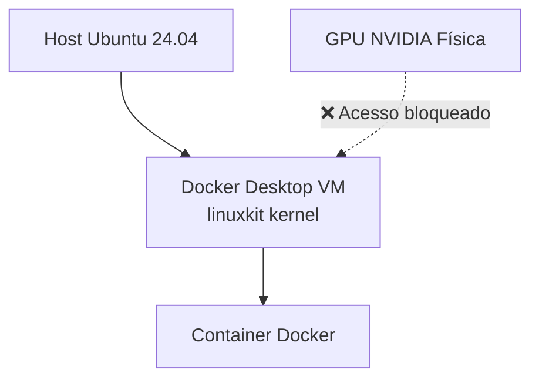

# 📊 Relatório Técnico: Diagnóstico e Solução para Acesso a GPU NVIDIA em Containers Docker  
**Ambiente:** Ubuntu 24.04 LTS  
**Data:** 14 de fevereiro de 2026  
**Problema Reportado:** `docker: Error response from daemon: could not select device driver "" with capabilities: [[gpu]]`

---

## 🔍 1. Resumo Executivo

O erro reportado ocorre devido à **incompatibilidade entre Docker Desktop e acesso direto a GPUs NVIDIA** no ambiente Linux. O Docker Desktop executa containers dentro de uma VM (`linuxkit`), que não possui acesso nativo aos dispositivos GPU físicos sem configuração especializada. A solução definitiva é migrar do Docker Desktop para o **Docker Engine nativo** combinado com o **NVIDIA Container Toolkit**, permitindo acesso direto às GPUs via runtime `nvidia`.

---

## 🧪 2. Diagnóstico do Ambiente Atual

### 2.1. Análise do `docker info` (extraída da conversa)

| Característica | Valor Observado | Impacto |
|----------------|------------------|---------|
| **Contexto** | `desktop-linux` | Indica uso do Docker Desktop (não Engine nativo) |
| **Sistema Operacional** | `Docker Desktop` / `linuxkit` | Containers rodam em VM isolada, sem acesso direto à GPU física |
| **Runtimes Disponíveis** | `runc`, `io.containerd.runc.v2` | ❌ **Runtime `nvidia` ausente** — causa direta do erro |
| **CDI Spec Directories** | Presente (`/etc/cdi`, `/var/run/cdi`) | Tecnologia potencialmente útil, mas não configurada para GPUs NVIDIA |
| **Kernel** | `6.12.54-linuxkit` | Kernel da VM do Docker Desktop, não do host físico |

### 2.2. Erros Observados na Sequência de Resolução

| Etapa | Erro | Causa Raiz |
|-------|------|------------|
| Tentativa inicial com `--gpus all` | `could not select device driver "" with capabilities: [[gpu]]` | Runtime NVIDIA não configurado |
| Após remoção parcial do Docker Desktop | `error getting credentials - docker-credential-desktop not found` | Arquivo `~/.docker/config.json` com referência residual ao credential helper do Docker Desktop |

---

## ⚙️ 3. Análise da Causa Raiz

### 3.1. Arquitetura Problemática Atual


- O Docker Desktop **não é recomendado para cargas de trabalho GPU** em Linux (documentação oficial da NVIDIA).
- A camada de virtualização impede o mapeamento direto de dispositivos PCI (`/dev/nvidia*`).
- O NVIDIA Container Toolkit **não funciona corretamente** dentro da VM do Docker Desktop.

### 3.2. Requisitos para Acesso a GPU em Containers

Para acesso funcional a GPUs NVIDIA, são necessários:
1. ✅ Drivers NVIDIA instalados no **host físico** (`nvidia-smi` funcional)
2. ✅ Docker Engine nativo (não Docker Desktop)
3. ✅ NVIDIA Container Toolkit instalado e configurado
4. ✅ Runtime `nvidia` registrado no daemon do Docker
5. ✅ Comando de execução com flag `--gpus all` ou equivalente

---

## 🛠️ 4. Plano de Ação Corretiva

### Etapa 1: Remoção Completa do Docker Desktop

```bash
#!/bin/bash
set -e

echo ">>> Etapa 1: Removendo Docker Desktop"

# 1.1. Encerrar processos
killall docker-desktop docker-desktop-proxy com.docker.backend 2>/dev/null || true
sudo systemctl --user stop docker-desktop docker-desktop.socket 2>/dev/null || true

# 1.2. Remover pacotes .deb
sudo apt remove docker-desktop docker-desktop-data -y 2>/dev/null || true

# 1.3. Limpar arquivos residuais
rm -rf ~/.docker/desktop ~/.docker/desktop* ~/.local/share/docker-desktop ~/.config/docker
rm -f ~/.docker/config.json  # Remove configuração com credential helper problemático

# 1.4. Remover repositório (se existir)
sudo rm -f /etc/apt/sources.list.d/docker-desktop.list

echo ">>> Docker Desktop removido com sucesso"
```

### Etapa 2: Instalação do Docker Engine Nativo

```bash
#!/bin/bash
set -e

echo ">>> Etapa 2: Instalando Docker Engine"

# 2.1. Remover versões conflitantes
sudo apt remove docker docker-engine docker.io containerd runc -y

# 2.2. Instalar dependências
sudo apt update
sudo apt install -y ca-certificates curl gnupg

# 2.3. Configurar repositório oficial
sudo install -m 0755 -d /etc/apt/keyrings
curl -fsSL https://download.docker.com/linux/ubuntu/gpg | \
  sudo gpg --dearmor -o /etc/apt/keyrings/docker.gpg
sudo chmod a+r /etc/apt/keyrings/docker.gpg

echo "deb [arch=$(dpkg --print-architecture) signed-by=/etc/apt/keyrings/docker.gpg] \
  https://download.docker.com/linux/ubuntu \
  $(. /etc/os-release && echo "$VERSION_CODENAME") stable" | \
  sudo tee /etc/apt/sources.list.d/docker.list > /dev/null

# 2.4. Instalar Docker Engine
sudo apt update
sudo apt install -y docker-ce docker-ce-cli containerd.io docker-buildx-plugin docker-compose-plugin

# 2.5. Adicionar usuário ao grupo docker
sudo usermod -aG docker $USER
newgrp docker 2>/dev/null || echo "Reinicie a sessão para aplicar permissões do grupo docker"

echo ">>> Docker Engine instalado com sucesso"
```

### Etapa 3: Configuração do NVIDIA Container Toolkit

```bash
#!/bin/bash
set -e

echo ">>> Etapa 3: Configurando NVIDIA Container Toolkit"

# 3.1. Verificar drivers NVIDIA no host
if ! command -v nvidia-smi &> /dev/null; then
    echo "❌ Drivers NVIDIA não encontrados. Instale-os antes de continuar:"
    echo "   https://www.nvidia.com/Download/index.aspx"
    exit 1
fi

# 3.2. Adicionar repositório da NVIDIA
curl -fsSL https://nvidia.github.io/libnvidia-container/gpgkey | \
  sudo gpg --dearmor -o /usr/share/keyrings/nvidia-container-toolkit-keyring.gpg

curl -s -L https://nvidia.github.io/libnvidia-container/stable/deb/nvidia-container-toolkit.list | \
  sed 's#deb https://#deb [signed-by=/usr/share/keyrings/nvidia-container-toolkit-keyring.gpg] https://#g' | \
  sudo tee /etc/apt/sources.list.d/nvidia-container-toolkit.list

# 3.3. Instalar toolkit
sudo apt update
sudo apt install -y nvidia-container-toolkit

# 3.4. Configurar runtime no daemon do Docker
sudo nvidia-ctk runtime configure --runtime=docker
sudo systemctl restart docker

echo ">>> NVIDIA Container Toolkit configurado com sucesso"
```

---

## ✅ 5. Validação da Solução

### 5.1. Verificações de Configuração

```bash
# 5.1.1. Verificar runtime NVIDIA
docker info | grep -A 2 "Runtimes"
# ✅ Saída esperada: Runtimes: nvidia runc io.containerd.runc.v2

# 5.1.2. Verificar drivers no host
nvidia-smi
# ✅ Deve exibir informações da GPU e drivers

# 5.1.3. Verificar acesso à GPU dentro do container
docker run --rm --gpus all nvidia/cuda:12.4.0-base-ubuntu22.04 nvidia-smi
# ✅ Deve exibir a mesma saída do nvidia-smi do host
```

### 5.2. Teste com Container vLLM

```bash
# Exemplo funcional com vLLM (usando tag válida)
docker run --gpus all --rm \
  -v ~/.cache/huggingface:/root/.cache/huggingface \
  nvcr.io/nvidia/vllm:v0.5.4-py3 \
  python -m vllm.entrypoints.api_server --model meta-llama/Llama-3.2-1B
```

> ⚠️ **Nota sobre tags:** A tag `25.09-py3` mencionada originalmente não existe oficialmente. Consulte tags válidas em:  
> https://catalog.ngc.nvidia.com/orgs/nvidia/containers/vllm

---

## 📋 6. Checklist de Verificação Pós-Implementação

| Item | Comando/Verificação | Status Esperado |
|------|---------------------|-----------------|
| Docker Desktop removido | `which docker-desktop` | ❌ Não encontrado |
| Docker Engine ativo | `docker --version` | ✅ Engine - Community |
| Runtime NVIDIA registrado | `docker info \| grep nvidia` | ✅ `Runtimes: nvidia ...` |
| Drivers NVIDIA no host | `nvidia-smi` | ✅ Saída com modelo da GPU |
| Acesso GPU no container | `docker run --gpus all nvidia/cuda:12.4.0-base-ubuntu22.04 nvidia-smi` | ✅ Saída idêntica ao host |
| Sem erros de credencial | `docker pull hello-world` | ✅ Sem mensagens `docker-credential-desktop` |

---

## ⚠️ 7. Considerações Adicionais e Boas Práticas

### 7.1. Por que evitar Docker Desktop em Linux para workloads GPU?
- Arquitetura baseada em VM adiciona latência e complexidade
- NVIDIA não oferece suporte oficial ao Docker Desktop para CUDA
- Docker Engine nativo é mais leve, performático e compatível com tooling NVIDIA

### 7.2. Gestão de Permissões
- Evite usar `sudo` com Docker após adicionar usuário ao grupo `docker`
- Reinicie a sessão após `usermod -aG docker $USER` para aplicar alterações

### 7.3. Atualizações Futuras
- Mantenha drivers NVIDIA atualizados (`sudo apt upgrade nvidia-driver-550`)
- Atualize NVIDIA Container Toolkit periodicamente (`sudo apt upgrade nvidia-container-toolkit`)
- Monitore compatibilidade entre versões de driver CUDA e containers

### 7.4. Troubleshooting Rápido
| Sintoma | Comando de Diagnóstico | Solução |
|---------|------------------------|---------|
| `no devices found` | `ls -la /dev/nvidia*` | Reinicie o serviço NVIDIA: `sudo systemctl restart nvidia-persistenced` |
| Falha no pull de imagem | `docker pull nvcr.io/nvidia/vllm:v0.5.4-py3` | Faça login no NGC: `docker login nvcr.io` |
| Erro de permissão | `docker run hello-world` | Execute `newgrp docker` ou reinicie a sessão |

---

## 📌 8. Conclusão

O erro `could not select device driver "" with capabilities: [[gpu]]` é causado pela **arquitetura incompatível do Docker Desktop com GPUs NVIDIA em Linux**. A solução definitiva requer:

1. **Remoção completa do Docker Desktop**
2. **Instalação do Docker Engine nativo**
3. **Configuração do NVIDIA Container Toolkit**

Após esta migração, containers com suporte a GPU (como vLLM, TensorRT, PyTorch) funcionarão corretamente com a flag `--gpus all`, permitindo aproveitar o hardware NVIDIA para inferência e treinamento de modelos de IA.

> ✅ **Ambiente validado para:** Ubuntu 24.04 LTS + NVIDIA GPU + Docker Engine 29.x + NVIDIA Container Toolkit 1.15+