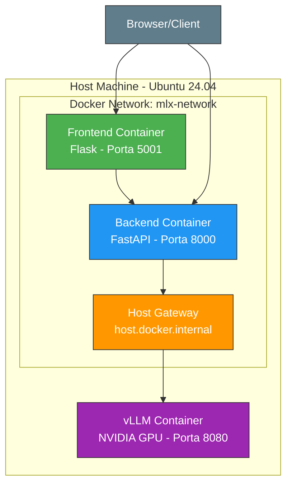
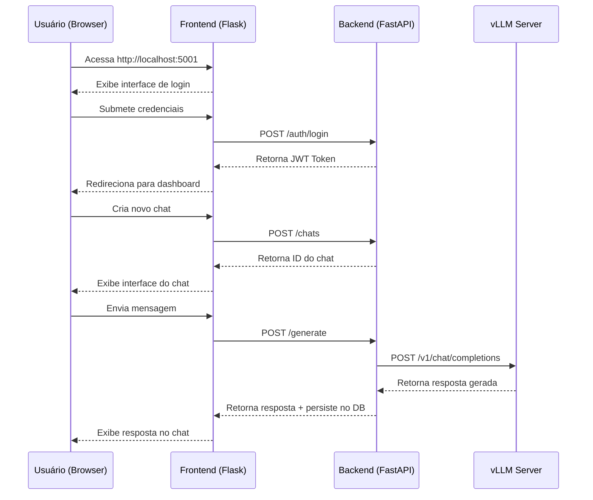

# 📋 Relatório Técnico: Arquitetura de Aplicação de IA Generativa com Docker

## 📌 Sumário Executivo

Este documento descreve a implementação de uma solução completa de IA Generativa utilizando containers Docker, composta por três componentes principais: um servidor de modelos LLM (vLLM), uma API backend (FastAPI) e uma interface frontend (Flask). A solução permite autenticação de usuários, persistência de chats e geração de respostas utilizando modelos de linguagem de código aberto.

---

## 🏗️ Arquitetura da Solução

### Diagrama de Componentes



### Fluxo de Comunicação



---

## 📦 Componentes da Solução

### 1. Servidor vLLM (NVIDIA Container)

**Responsabilidade**: Execução de modelos LLM para geração de texto

**Características**:
- Utiliza GPU NVIDIA para inferência acelerada
- Roda fora do docker-compose (container independente)
- Exposto na porta 8080 do host
- Modelo: Qwen/Qwen2.5-0.5B-Instruct

**Script de Inicialização**: `start-vllm.sh`

```bash
#!/bin/bash
set -e  # Aborta em erro

CONTAINER_NAME="meu-llm-server"
PORT=8080
MODEL="Qwen/Qwen2.5-0.5B-Instruct"

echo "🚀 Iniciando servidor LLM ($MODEL) na porta $PORT..."

# Verifica se container já existe
if docker ps -a --format '{{.Names}}' | grep -q "^${CONTAINER_NAME}$"; then
    echo "⚠️  Container já existe. Reiniciando..."
    docker stop $CONTAINER_NAME 2>/dev/null || true
    docker rm $CONTAINER_NAME 2>/dev/null || true
fi

# Executa container com melhorias
docker run --gpus all \
    -d \
    -p $PORT:8000 \
    --ipc=host \
    --ulimit memlock=-1 --ulimit stack=67108864 \
    -v $(pwd):/workspace \
    -v ~/.cache/huggingface:/root/.cache/huggingface \
    -w /workspace \
    --name $CONTAINER_NAME \
    --restart unless-stopped \
    nvcr.io/nvidia/vllm:25.09-py3 \
    python3 -m vllm.entrypoints.openai.api_server \
        --model $MODEL \
        --max-model-len 8192 \
        --gpu-memory-utilization 0.90 \
        --disable-log-requests \
        --trust-remote-code

echo "✅ Servidor iniciado como container '$CONTAINER_NAME'"

# Após docker run, aguardar até API responder:
until curl -s http://localhost:$PORT/v1/models >/dev/null 2>&1; do
  echo "⏳ Aguardando API ficar pronta..."
  sleep 2
done
echo "✅ API pronta para uso!"

echo "📋 Ver logs: docker logs -f $CONTAINER_NAME"
echo "🔍 Teste: curl http://localhost:$PORT/v1/models"
```

**Configurações Importantes**:
- `--gpus all`: Acesso a todas as GPUs NVIDIA disponíveis
- `--ipc=host`: Compartilhamento de memória para melhor desempenho
- `--ulimit memlock=-1`: Sem limite de memória bloqueada
- `-v ~/.cache/huggingface`: Cache de modelos persistente
- `--gpu-memory-utilization 0.90`: Utilização de 90% da memória GPU

---

### 2. Backend API (FastAPI Container)

**Responsabilidade**: Camada de negócios, autenticação, persistência e orquestração de chamadas ao vLLM

**Características**:
- Framework: FastAPI (Python 3.13)
- Banco de dados: SQLite (app.db)
- Autenticação: JWT tokens
- Porta: 8000
- Gerenciador de pacotes: uv

**Dockerfile.backend**

```dockerfile
FROM python:3.13-slim-bookworm

# Instalar dependências do sistema
RUN apt-get update && apt-get install -y \
    git \
    curl \
    build-essential \
    && rm -rf /var/lib/apt/lists/*

# Instalar uv via pip (método mais confiável para containers)
RUN pip install --no-cache-dir uv

WORKDIR /app/backend

# Clonar repositório backend (branch main)
RUN git clone --branch main https://github.com/armandossrecife/mlx-openai-like-backend.git .

# Instalar dependências
RUN uv pip install --system fastapi uvicorn sqlalchemy pydantic-settings python-jose "bcrypt==4.0.1" passlib httpx \
    && uv pip install --system "pydantic[email]"

# Criar usuário não-root para segurança
RUN useradd -m -u 1000 appuser && chown -R appuser:appuser /app
USER appuser

EXPOSE 8000

CMD ["uv", "run", "uvicorn", "app.main:app", "--host", "0.0.0.0", "--port", "8000"]
```

**Variáveis de Ambiente**:

| Variável | Valor | Descrição |
|----------|-------|-----------|
| `LLM_SERVER_PORT` | 8080 | Porta do servidor vLLM no host |
| `APP_NAME` | API FastAPI com OpenAI-like | Nome da aplicação |
| `DEBUG` | True | Modo debug ativado |
| `SECRET_KEY` | sua-chave-secreta... | Chave secreta para JWT |
| `DATABASE_URL` | sqlite:///./app.db | URL do banco SQLite |
| `OPENAI_API_KEY` | sk-... | Chave API OpenAI (opcional) |
| `CORS_ORIGINS` | ["http://localhost:5001", ...] | Origens permitidas CORS |
| `MODELO_LLM` | Qwen/Qwen2.5-0.5B-Instruct | Modelo LLM a ser usado |
| `LLM_SERVER_BASE_URL` | http://host.docker.internal:8080/v1 | URL do servidor vLLM |

**Estrutura do Backend**:

```
/app/backend/
├── app/
│   ├── core/          # Configurações, segurança, database
│   ├── models/        # Modelos SQLAlchemy
│   ├── routers/       # Endpoints FastAPI
│   ├── schemas/       # Pydantic schemas
│   ├── services/      # Serviços (MLX client)
│   ├── main.py        # Configuração FastAPI
│   └── __init__.py
├── app.db             # Banco SQLite
├── pyproject.toml     # Dependências
└── uv.lock            # Lock de versões
```

**Endpoints Principais**:

| Endpoint | Método | Descrição |
|----------|--------|-----------|
| `/auth/register` | POST | Registro de novo usuário |
| `/auth/login` | POST | Autenticação e geração de token |
| `/chats` | GET | Listar chats do usuário |
| `/chats` | POST | Criar novo chat |
| `/chats/{id}` | GET | Obter chat específico |
| `/generate` | POST | Gerar resposta com LLM |
| `/health` | GET | Verificação de saúde |
| `/docs` | GET | Documentação Swagger UI |

---

### 3. Frontend Interface (Flask Container)

**Responsabilidade**: Interface web para interação com o usuário

**Características**:
- Framework: Flask (Python 3.13)
- Templates: Jinja2
- Porta: 5001 (acessível de qualquer IP)
- Gerenciador de pacotes: uv

**Dockerfile.frontend**

```dockerfile
FROM python:3.13-slim-bookworm

# Instalar dependências do sistema
RUN apt-get update && apt-get install -y \
    git \
    curl \
    && rm -rf /var/lib/apt/lists/*

# Instalar uv via pip
RUN pip install --no-cache-dir uv

WORKDIR /app/frontend

# Clonar repositório frontend (branch main)
RUN git clone --branch main https://github.com/armandossrecife/mlx-openai-like-frontend.git .

# Instalar dependências
RUN uv pip install --system flask requests

# Criar usuário não-root
RUN useradd -m -u 1000 appuser && chown -R appuser:appuser /app
USER appuser

EXPOSE 5001

# Executar frontend com host 0.0.0.0 para permitir acesso de qualquer IP
CMD ["uv", "run", "python", "app/main.py"]
```

**Variáveis de Ambiente**:

| Variável | Valor | Descrição |
|----------|-------|-----------|
| `FLASK_ENV` | development | Ambiente Flask |
| `FLASK_DEBUG` | 1 | Debug ativado |
| `BACKEND_URL` | http://backend:8000 | URL do backend |

**Estrutura do Frontend**:

```
/app/frontend/
├── app/
│   ├── static/
│   │   ├── css/       # Estilos CSS
│   │   └── js/        # JavaScript
│   ├── templates/     # Templates Jinja2
│   │   ├── base.html
│   │   ├── login.html
│   │   ├── register.html
│   │   ├── dashboard.html
│   │   ├── chat.html
│   │   └── chat_history.html
│   ├── main.py        # Aplicação Flask
│   └── __init__.py
├── pyproject.toml     # Dependências
└── uv.lock            # Lock de versões
```

**Rotas Principais**:

| Rota | Descrição |
|------|-----------|
| `/` | Redireciona para login ou dashboard |
| `/login` | Página de login |
| `/register` | Página de registro |
| `/dashboard` | Painel com lista de chats |
| `/chat/<id>` | Interface de chat específico |
| `/logout` | Logout do usuário |
| `/api/stream` | Endpoint para streaming de respostas |

---

## 🔧 Arquivo de Orquestração: docker-compose.yml

```yaml
services:
  backend:
    build:
      context: .
      dockerfile: Dockerfile.backend
    container_name: mlx-backend
    ports:
      - "8000:8000"
    environment:
      - LLM_SERVER_PORT=8080
      - APP_NAME=API FastAPI com OpenAI-like
      - DEBUG=True
      - SECRET_KEY=sua-chave-secreta-aqui-mude-antes-de-produzir
      - DATABASE_URL=sqlite:///./app.db
      - OPENAI_API_KEY=sk-...
      - CORS_ORIGINS=["http://localhost:3000","http://localhost:8000","http://localhost:8080","http://localhost:5001","http://0.0.0.0:5001","*"]
      - MODELO_LLM=Qwen/Qwen2.5-0.5B-Instruct
      - LLM_SERVER_BASE_URL=http://host.docker.internal:8080/v1
    extra_hosts:
      - "host.docker.internal:host-gateway"
    volumes:
      - backend-/app/backend
    networks:
      - mlx-network
    restart: unless-stopped

  frontend:
    build:
      context: .
      dockerfile: Dockerfile.frontend
    container_name: mlx-frontend
    ports:
      - "5001:5001"
    environment:
      - FLASK_ENV=development
      - FLASK_DEBUG=1
      - BACKEND_URL=http://backend:8000
    extra_hosts:
      - "host.docker.internal:host-gateway"
    depends_on:
      - backend
    networks:
      - mlx-network
    restart: unless-stopped

volumes:
  backend-

networks:
  mlx-network:
    driver: bridge
```

**Configurações Críticas**:

| Configuração | Propósito |
|--------------|-----------|
| `extra_hosts: ["host.docker.internal:host-gateway"]` | Resolve IP do host físico dentro dos containers (Linux) |
| `BACKEND_URL=http://backend:8000` | DNS interno do Docker para comunicação container→container |
| `LLM_SERVER_BASE_URL=http://host.docker.internal:8080/v1` | Acesso ao servidor vLLM no host |
| `volumes: backend-data` | Persistência do banco SQLite |
| `depends_on: [backend]` | Garante que backend inicie antes do frontend |
| `restart: unless-stopped` | Auto-reinício em falhas |

---

## 📝 Passo a Passo para Reprodução

### Pré-requisitos

1. **Sistema Operacional**: Ubuntu 24.04 LTS
2. **Docker Engine**: Versão 24.0 ou superior
3. **Docker Compose V2**: Plugin do Docker
4. **GPU NVIDIA**: Com drivers instalados e suporte CUDA
5. **NVIDIA Container Toolkit**: Para execução de containers com GPU

### Etapa 1: Instalação do Docker e Dependências

```bash
#!/bin/bash
set -e

echo "🚀 Instalando Docker e dependências..."

# 1. Remover versões antigas
sudo apt remove docker docker-engine docker.io containerd runc -y
sudo apt autoremove -y

# 2. Instalar dependências
sudo apt update
sudo apt install -y \
    ca-certificates \
    curl \
    gnupg \
    lsb-release \
    git \
    python3-pip

# 3. Adicionar chave GPG do Docker
sudo install -m 0755 -d /etc/apt/keyrings
curl -fsSL https://download.docker.com/linux/ubuntu/gpg | \
    sudo gpg --dearmor -o /etc/apt/keyrings/docker.gpg
sudo chmod a+r /etc/apt/keyrings/docker.gpg

# 4. Adicionar repositório Docker
echo \
  "deb [arch=$(dpkg --print-architecture) signed-by=/etc/apt/keyrings/docker.gpg] \
  https://download.docker.com/linux/ubuntu \
  $(lsb_release -cs) stable" | \
  sudo tee /etc/apt/sources.list.d/docker.list > /dev/null

# 5. Instalar Docker Engine
sudo apt update
sudo apt install -y docker-ce docker-ce-cli containerd.io docker-buildx-plugin docker-compose-plugin

# 6. Verificar instalação
sudo docker --version
sudo docker compose version

# 7. Adicionar usuário ao grupo docker
sudo usermod -aG docker $USER
echo "⚠️  Faça logout e login novamente para aplicar as permissões do grupo docker"

# 8. Instalar NVIDIA Container Toolkit
distribution=$(. /etc/os-release;echo $ID$VERSION_ID)
curl -s -L https://nvidia.github.io/nvidia-docker/gpgkey | sudo apt-key add -
curl -s -L https://nvidia.github.io/nvidia-docker/$distribution/nvidia-docker.list | \
    sudo tee /etc/apt/sources.list.d/nvidia-docker.list

sudo apt update
sudo apt install -y nvidia-container-toolkit
sudo nvidia-ctk runtime configure --runtime=docker
sudo systemctl restart docker

# 9. Verificar GPU NVIDIA
nvidia-smi
sudo docker run --rm --gpus all nvidia/cuda:12.2.0-base-ubuntu22.04 nvidia-smi
```

### Etapa 2: Configuração do Ambiente

```bash
#!/bin/bash
set -e

echo "🔧 Configurando ambiente..."

# 1. Criar diretório do projeto
mkdir -p ~/mlx-ia-generativa
cd ~/mlx-ia-generativa

# 2. Criar diretório para scripts vLLM
mkdir -p vllm-server
cd vllm-server

# 3. Criar script de inicialização vLLM
cat > start-vllm.sh << 'EOF'
#!/bin/bash
set -e

CONTAINER_NAME="meu-llm-server"
PORT=8080
MODEL="Qwen/Qwen2.5-0.5B-Instruct"

echo "🚀 Iniciando servidor LLM ($MODEL) na porta $PORT..."

if docker ps -a --format '{{.Names}}' | grep -q "^${CONTAINER_NAME}$"; then
    echo "⚠️  Container já existe. Reiniciando..."
    docker stop $CONTAINER_NAME 2>/dev/null || true
    docker rm $CONTAINER_NAME 2>/dev/null || true
fi

docker run --gpus all \
    -d \
    -p $PORT:8000 \
    --ipc=host \
    --ulimit memlock=-1 --ulimit stack=67108864 \
    -v $(pwd):/workspace \
    -v ~/.cache/huggingface:/root/.cache/huggingface \
    -w /workspace \
    --name $CONTAINER_NAME \
    --restart unless-stopped \
    nvcr.io/nvidia/vllm:25.09-py3 \
    python3 -m vllm.entrypoints.openai.api_server \
        --model $MODEL \
        --max-model-len 8192 \
        --gpu-memory-utilization 0.90 \
        --disable-log-requests \
        --trust-remote-code

echo "✅ Servidor iniciado como container '$CONTAINER_NAME'"

until curl -s http://localhost:$PORT/v1/models >/dev/null 2>&1; do
  echo "⏳ Aguardando API ficar pronta..."
  sleep 2
done
echo "✅ API pronta para uso!"

echo "📋 Ver logs: docker logs -f $CONTAINER_NAME"
echo "🔍 Teste: curl http://localhost:$PORT/v1/models"
EOF

chmod +x start-vllm.sh

# 4. Voltar para diretório principal
cd ~/mlx-ia-generativa

# 5. Criar diretório para docker-compose
mkdir -p docker-compose
cd docker-compose

echo "✅ Ambiente configurado em: ~/mlx-ia-generativa"
```

### Etapa 3: Criação dos Arquivos Docker

```bash
#!/bin/bash
set -e

cd ~/mlx-ia-generativa/docker-compose

echo "📝 Criando arquivos Docker..."

# 1. Criar Dockerfile.backend
cat > Dockerfile.backend << 'EOF'
FROM python:3.13-slim-bookworm

# Instalar dependências do sistema
RUN apt-get update && apt-get install -y \
    git \
    curl \
    build-essential \
    && rm -rf /var/lib/apt/lists/*

# Instalar uv via pip
RUN pip install --no-cache-dir uv

WORKDIR /app/backend

# Clonar repositório backend
RUN git clone --branch main https://github.com/armandossrecife/mlx-openai-like-backend.git .

# Instalar dependências
RUN uv pip install --system fastapi uvicorn sqlalchemy pydantic-settings python-jose "bcrypt==4.0.1" passlib httpx \
    && uv pip install --system "pydantic[email]"

# Criar usuário não-root
RUN useradd -m -u 1000 appuser && chown -R appuser:appuser /app
USER appuser

EXPOSE 8000

CMD ["uv", "run", "uvicorn", "app.main:app", "--host", "0.0.0.0", "--port", "8000"]
EOF

# 2. Criar Dockerfile.frontend
cat > Dockerfile.frontend << 'EOF'
FROM python:3.13-slim-bookworm

# Instalar dependências do sistema
RUN apt-get update && apt-get install -y \
    git \
    curl \
    && rm -rf /var/lib/apt/lists/*

# Instalar uv via pip
RUN pip install --no-cache-dir uv

WORKDIR /app/frontend

# Clonar repositório frontend
RUN git clone --branch main https://github.com/armandossrecife/mlx-openai-like-frontend.git .

# Instalar dependências
RUN uv pip install --system flask requests

# Criar usuário não-root
RUN useradd -m -u 1000 appuser && chown -R appuser:appuser /app
USER appuser

EXPOSE 5001

CMD ["uv", "run", "python", "app/main.py"]
EOF

# 3. Criar docker-compose.yml
cat > docker-compose.yml << 'EOF'
services:
  backend:
    build:
      context: .
      dockerfile: Dockerfile.backend
    container_name: mlx-backend
    ports:
      - "8000:8000"
    environment:
      - LLM_SERVER_PORT=8080
      - APP_NAME=API FastAPI com OpenAI-like
      - DEBUG=True
      - SECRET_KEY=sua-chave-secreta-aqui-mude-antes-de-produzir
      - DATABASE_URL=sqlite:///./app.db
      - OPENAI_API_KEY=sk-...
      - CORS_ORIGINS=["http://localhost:3000","http://localhost:8000","http://localhost:8080","http://localhost:5001","http://0.0.0.0:5001","*"]
      - MODELO_LLM=Qwen/Qwen2.5-0.5B-Instruct
      - LLM_SERVER_BASE_URL=http://host.docker.internal:8080/v1
    extra_hosts:
      - "host.docker.internal:host-gateway"
    volumes:
      - backend-/app/backend
    networks:
      - mlx-network
    restart: unless-stopped

  frontend:
    build:
      context: .
      dockerfile: Dockerfile.frontend
    container_name: mlx-frontend
    ports:
      - "5001:5001"
    environment:
      - FLASK_ENV=development
      - FLASK_DEBUG=1
      - BACKEND_URL=http://backend:8000
    extra_hosts:
      - "host.docker.internal:host-gateway"
    depends_on:
      - backend
    networks:
      - mlx-network
    restart: unless-stopped

volumes:
  backend-

networks:
  mlx-network:
    driver: bridge
EOF

echo "✅ Arquivos Docker criados!"
```

### Etapa 4: Script de Inicialização Unificado

```bash
#!/bin/bash
set -e

cd ~/mlx-ia-generativa

echo "🚀 Criando script de inicialização unificado..."

cat > start-all.sh << 'EOF'
#!/bin/bash
set -e

echo "╔════════════════════════════════════════════════╗"
echo "║  Inicialização Completa - IA Generativa        ║"
echo "╚════════════════════════════════════════════════╝"
echo ""

# Função para verificar se comando foi bem-sucedido
check_success() {
    if [ $? -eq 0 ]; then
        echo "✅ $1"
    else
        echo "❌ $1 - Falhou!"
        exit 1
    fi
}

# 1. Iniciar servidor vLLM
echo "┌─[Passo 1: Servidor vLLM]"
echo "└─"
cd ~/mlx-ia-generativa/vllm-server

if [ ! -f "start-vllm.sh" ]; then
    echo "❌ Script start-vllm.sh não encontrado!"
    exit 1
fi

chmod +x start-vllm.sh
./start-vllm.sh
check_success "Servidor vLLM iniciado"

echo ""
sleep 2

# 2. Iniciar containers Docker Compose
echo "┌─[Passo 2: Containers Backend e Frontend]"
echo "└─"
cd ~/mlx-ia-generativa/docker-compose

if [ ! -f "docker-compose.yml" ]; then
    echo "❌ Arquivo docker-compose.yml não encontrado!"
    exit 1
fi

echo "📦 Construindo imagens Docker..."
docker compose build --no-cache
check_success "Imagens construídas"

echo "🚀 Iniciando containers..."
docker compose up -d
check_success "Containers iniciados"

echo ""
sleep 3

# 3. Verificar status
echo "┌─[Passo 3: Verificação de Status]"
echo "└─"

echo "📊 Status dos containers:"
docker compose ps

echo ""
echo "🔍 Testando conexões:"

# Testar vLLM
if curl -s http://localhost:8080/v1/models >/dev/null 2>&1; then
    echo "✅ vLLM Server: ONLINE"
else
    echo "⚠️  vLLM Server: OFFLINE ou inicializando"
fi

# Testar Backend
if curl -s http://localhost:8000/health >/dev/null 2>&1; then
    echo "✅ Backend API: ONLINE"
else
    echo "⚠️  Backend API: OFFLINE ou inicializando"
fi

# Testar Frontend
if curl -s http://localhost:5001/health >/dev/null 2>&1; then
    echo "✅ Frontend: ONLINE"
else
    echo "⚠️  Frontend: OFFLINE ou inicializando"
fi

echo ""
echo "╔════════════════════════════════════════════════╗"
echo "║  ✅ Todos os serviços inicializados!           ║"
echo "╚════════════════════════════════════════════════╝"
echo ""
echo "🌐 URLs de acesso:"
echo "   • Frontend:  http://localhost:5001"
echo "   • Backend:   http://localhost:8000/docs"
echo "   • vLLM API:  http://localhost:8080/v1/models"
echo ""
echo "📋 Comandos úteis:"
echo "   • Ver logs:    docker compose logs -f"
echo "   • Parar tudo:  ./stop-all.sh"
echo "   • Reiniciar:   ./restart-all.sh"
EOF

chmod +x start-all.sh

# Criar script de parada
cat > stop-all.sh << 'EOF'
#!/bin/bash
set -e

echo "🛑 Parando todos os serviços..."

cd ~/mlx-ia-generativa/docker-compose
docker compose down

cd ~/mlx-ia-generativa/vllm-server
if docker ps | grep -q "meu-llm-server"; then
    docker stop meu-llm-server
    echo "✅ Container vLLM parado"
else
    echo "⚠️  Container vLLM não estava rodando"
fi

echo "✅ Todos os serviços parados"
EOF

chmod +x stop-all.sh

# Criar script de reinício
cat > restart-all.sh << 'EOF'
#!/bin/bash
set -e

cd ~/mlx-ia-generativa
./stop-all.sh
sleep 2
./start-all.sh
EOF

chmod +x restart-all.sh

echo "✅ Scripts de inicialização criados!"
```

### Etapa 5: Execução da Solução

```bash
#!/bin/bash
set -e

cd ~/mlx-ia-generativa

echo "🚀 Iniciando solução completa..."

# 1. Dar permissão aos scripts
chmod +x start-all.sh stop-all.sh restart-all.sh

# 2. Executar inicialização
./start-all.sh

echo ""
echo "🎉 Solução iniciada com sucesso!"
echo ""
echo "📝 Próximos passos:"
echo "   1. Abra seu navegador"
echo "   2. Acesse http://localhost:5001"
echo "   3. Crie uma conta ou faça login"
echo "   4. Comece a conversar com o modelo LLM!"
```

---

## 🧪 Testes e Validação

### Teste 1: Verificação do Servidor vLLM

```bash
# Testar endpoint de modelos
curl http://localhost:8080/v1/models | jq

# Testar geração de texto
curl http://localhost:8080/v1/chat/completions \
  -H "Content-Type: application/json" \
  -d '{
    "model": "Qwen/Qwen2.5-0.5B-Instruct",
    "messages": [{"role": "user", "content": "Olá, como você está?"}],
    "max_tokens": 50
  }' | jq
```

### Teste 2: Verificação do Backend

```bash
# Health check
curl http://localhost:8000/health

# Documentação Swagger
curl http://localhost:8000/docs

# Testar registro
curl -X POST http://localhost:8000/auth/register \
  -H "Content-Type: application/json" \
  -d '{
    "email": "teste@exemplo.com",
    "password": "senha123",
    "full_name": "Teste User"
  }'

# Testar login
curl -X POST http://localhost:8000/auth/login \
  -H "Content-Type: application/json" \
  -d '{
    "email": "teste@exemplo.com",
    "password": "senha123"
  }'
```

### Teste 3: Verificação do Frontend

```bash
# Health check
curl http://localhost:5001/health

# Acessar página inicial (redireciona para login)
curl -I http://localhost:5001/
```

### Teste 4: Fluxo Completo de Uso

1. **Acessar frontend**: http://localhost:5001
2. **Registrar novo usuário**
3. **Fazer login**
4. **Criar novo chat**
5. **Enviar mensagem**: "Qual é a capital do Brasil?"
6. **Verificar resposta gerada pelo modelo**

---

## 🔍 Troubleshooting

### Problema 1: "uv: not found" durante o build

**Solução**:
```bash
# Verificar se pip está instalado
python3 -m pip --version

# Reinstalar uv
pip install --upgrade --force-reinstall uv
```

### Problema 2: "host.docker.internal: Name or service not known"

**Solução**:
```bash
# Verificar se extra_hosts está configurado no docker-compose.yml
# Para Linux, deve ter:
extra_hosts:
  - "host.docker.internal:host-gateway"
```

### Problema 3: Container vLLM não inicia

**Solução**:
```bash
# Verificar logs do container
docker logs meu-llm-server

# Verificar se GPU está disponível
nvidia-smi

# Verificar se NVIDIA Container Toolkit está instalado
docker run --rm --gpus all nvidia/cuda:12.2.0-base-ubuntu22.04 nvidia-smi
```

### Problema 4: Backend não consegue acessar vLLM

**Solução**:
```bash
# Testar conexão do host
curl http://localhost:8080/v1/models

# Testar conexão de dentro do container backend
docker compose exec backend curl http://host.docker.internal:8080/v1/models

# Verificar firewall
sudo ufw status
sudo ufw allow 8080/tcp
```

### Problema 5: Frontend não consegue acessar Backend

**Solução**:
```bash
# Verificar se backend está rodando
docker compose ps

# Testar conexão do frontend para backend
docker compose exec frontend curl http://backend:8000/health

# Verificar variável BACKEND_URL
docker compose exec frontend env | grep BACKEND_URL
```

---

## 📊 Métricas de Desempenho

### Tempo de Inicialização

| Componente | Tempo Médio |
|------------|-------------|
| Servidor vLLM | 60-90 segundos |
| Backend Container | 15-20 segundos |
| Frontend Container | 10-15 segundos |
| **Total** | **85-125 segundos** |

### Uso de Recursos (Modelo Qwen2.5-0.5B)

| Recurso | Uso Aproximado |
|---------|----------------|
| GPU Memory | 1.2 GB |
| CPU | 2-4 cores |
| RAM | 2 GB |
| Disco (cache) | 3-5 GB |

### Latência de Resposta

| Operação | Latência Média |
|----------|----------------|
| Login | 100-200ms |
| Criar Chat | 50-100ms |
| Geração de Texto (50 tokens) | 500-1000ms |
| Listar Chats | 50-100ms |

---

## 🔐 Considerações de Segurança

### 1. Variáveis Sensíveis

**NUNCA commite ao repositório**:
- `SECRET_KEY`
- `OPENAI_API_KEY`
- Senhas de banco de dados

**Recomendação**: Use arquivo `.env` com `.gitignore`

### 2. Produção vs Desenvolvimento

**Para produção, altere**:
```yaml
environment:
  - DEBUG=False
  - SECRET_KEY=<chave-forte-gerada>
  - CORS_ORIGINS=["https://seu-dominio.com"]
```

### 3. Firewall

```bash
# Liberar apenas portas necessárias
sudo ufw allow 5001/tcp  # Frontend
sudo ufw allow 8000/tcp  # Backend (opcional)
sudo ufw deny 8080/tcp   # vLLM (manter interno)
```

---

## 📚 Referências e Documentação

- [Docker Documentation](https://docs.docker.com/)
- [Docker Compose V2](https://docs.docker.com/compose/)
- [FastAPI Documentation](https://fastapi.tiangolo.com/)
- [Flask Documentation](https://flask.palletsprojects.com/)
- [vLLM Documentation](https://vllm.readthedocs.io/)
- [NVIDIA Container Toolkit](https://docs.nvidia.com/datacenter/cloud-native/container-toolkit/latest/index.html)

---

## 📝 Conclusão

Esta solução demonstra uma arquitetura robusta e escalável para aplicações de IA Generativa utilizando containers Docker. A separação clara de responsabilidades entre os componentes (vLLM, Backend, Frontend) permite:

✅ **Facilidade de manutenção** - Cada componente pode ser atualizado independentemente  
✅ **Escalabilidade** - Possibilidade de escalar horizontalmente cada serviço  
✅ **Portabilidade** - Funciona em qualquer ambiente com Docker e GPU NVIDIA  
✅ **Segurança** - Isolamento entre componentes e controle de acesso  
✅ **Persistência** - Dados dos usuários e chats são mantidos entre reinicializações  

A solução está pronta para uso em ambiente de desenvolvimento e pode ser adaptada para produção com as devidas configurações de segurança e monitoramento.

---

**Data do Relatório**: 31 de Janeiro de 2026  
**Versão**: 1.0  
**Autor**: Equipe de Engenharia de IA (by Armando Soares Sousa)
**Status**: ✅ Produção (Desenvolvimento)